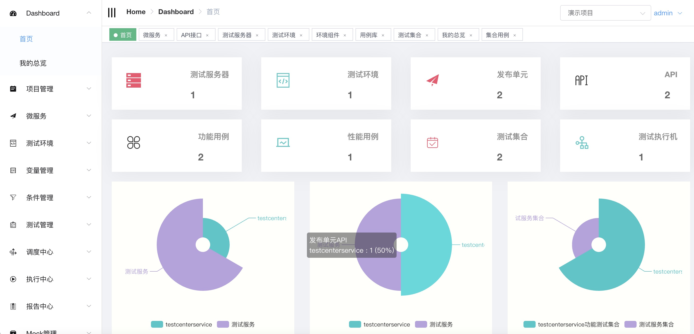
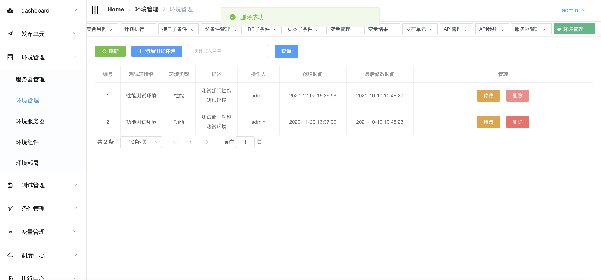
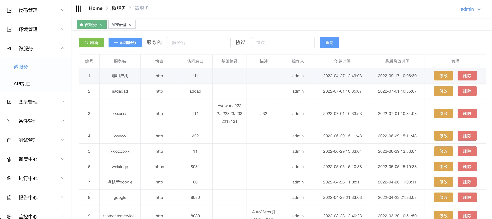
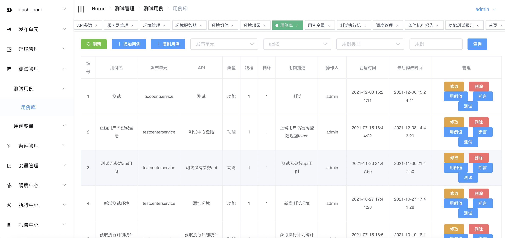
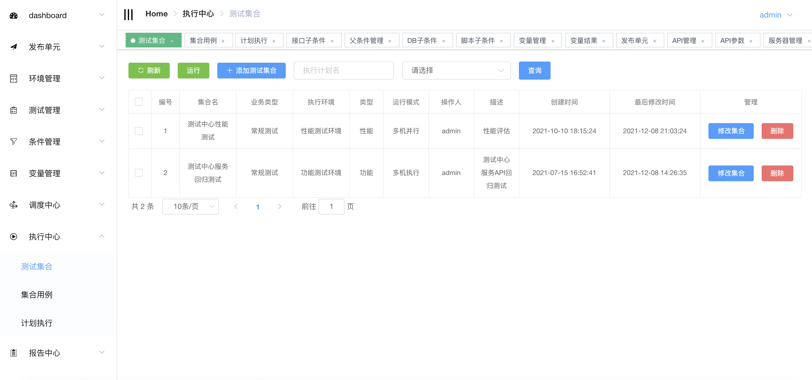
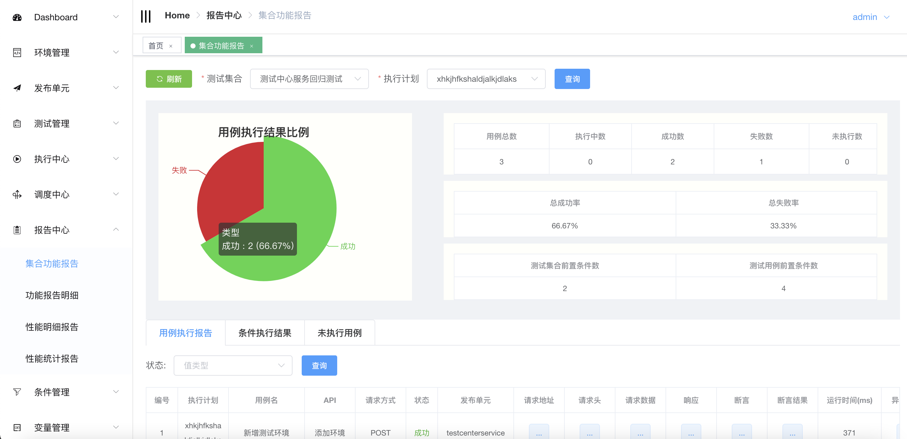
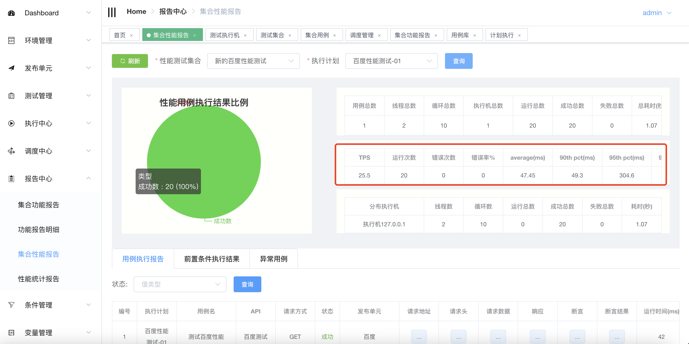
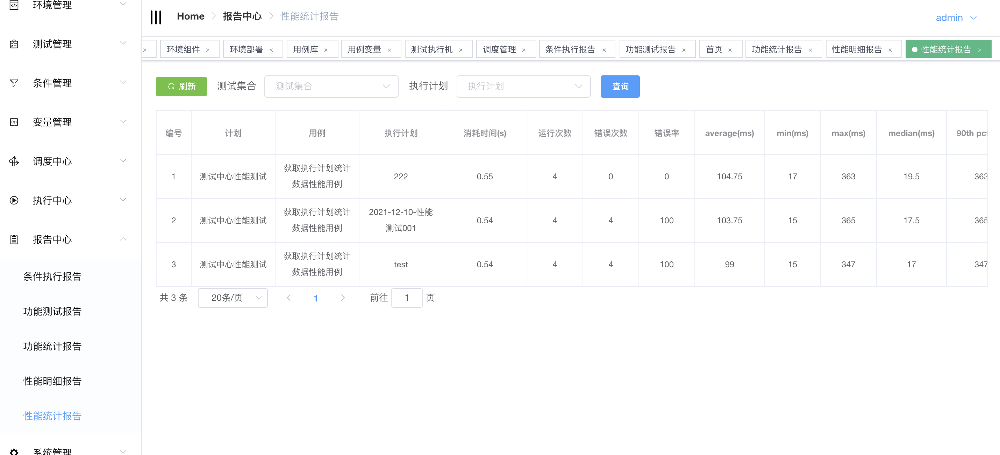

# AutoMeter

1.AutoMeter是一款针对分布式服务，微服务API做功能和性能一体化的自动化测试平台,一站式提供发布单元，API，环境，用例，前置条件，场景，变量，计划，报告等管理

在项目开发，迭代交付过程中开发人员，测试人员需要针对系统提供的API做调试，回归测试，性能测试。自动化测试，一个好的平台本质上需要解决API测试的5大基本问题：
  
    1.支持不同的角色，技术人员多人协作
    2.支持定义多个不同的测试环境
    3.支持定义各种被测系统，API
    4.支持功能，性能，回归，自动化测试
    5.功能/性能明细报告，统计报告，通知

### 1.运行测试的环境如何定义？

一般个人，公司在使用分布式，微服务架构，从开发到发布上线可能会经过多套环境测试验证，比如开发环境，测试环境，准生产环境，生产环境，其中测试环境又可能分为多套功能测试环境和性能测试环境，多套环境分开管理，可以有序而不相互干扰进行测试工作
每套环境由开发的发布单元(服务，站点，应用各个公司叫法不一样)，即提供api服务能力的实体，中间件(数据库，nosql，web服务器等等)这些元素组成
对于测试来说以上的元素我们需要部署到指定的服务器或者容器中整体来作为一套环境做测试工作

### 2.针对什么来做测试？

针对具体开发的服务(发布单元，应用，站点)，既提供API的实体，这边我们命名为发布单元，可以定义访问此服务的协议，端口。
此发布单元包含了若干个API，每个API会有对应的参数需要维护，这其实也是个人或者公司提供对内对外api能力的定义

### 3.设计测试用例

从个人或者公司的角度看，用例的数量和类型来决定需要做怎么样的执行，如果用例数量庞大，并且需要快速得到结果，本质上我们需要拆分用例由多机并行执行满足需求，也就是多点执行，如果需要性能的测试，执行性能的机器我们可以是低性能的多台机器发起或者是高性能的少量机器发起，所以说怎么运行是根据需要来定制执行用例的类型和机器数量

### 4.运行用例

根据测试业务需要，定义成多个测试集合来满足不同的测试需要，功能测试，性能测试，回归测试，CI对接自动化测试

### 5.获得什么样的反馈报告？

对于用例执行完，我们希望看到什么反馈，对于开发，测试，或者其他技术人员，我们希望看到运行的用例详细信息：结果状态，运行时间，请求数据，API的具体响应，我的期望，断言的详细信息，以及用例运行时的信息，对应性能来说，我们还希望能得到统计的信息，比如整体性能的时间，tps，响应时间，99%pct等，以及性能结果的多次对比

## 架构

 

 [架构设计](https://gitee.com/season-fan/autometer-api/wikis/%E6%8A%80%E6%9C%AF%E5%AE%9E%E7%8E%B0/%E6%8A%80%E6%9C%AF%E6%9E%B6%E6%9E%84?sort_id=4936162)

## 部署
 [服务器部署](https://gitee.com/season-fan/autometer-api/wikis/%E9%83%A8%E7%BD%B2/%E6%9C%8D%E5%8A%A1%E5%99%A8%E9%83%A8%E7%BD%B2?sort_id=4960162)

[服务器简易部署](https://gitee.com/season-fan/autometer-api/wikis/%E9%83%A8%E7%BD%B2%EF%BC%8C%E6%9B%B4%E6%96%B0/%E6%9C%8D%E5%8A%A1%E5%99%A8%E7%AE%80%E6%98%93%E9%83%A8%E7%BD%B2?sort_id=5701353)

 [Docker部署](https://gitee.com/season-fan/autometer-api/wikis/%E9%83%A8%E7%BD%B2%EF%BC%8C%E6%9B%B4%E6%96%B0/%E5%AE%B9%E5%99%A8%E9%83%A8%E7%BD%B2%EF%BC%88DockerFile%EF%BC%89)

[docker-compose部署](https://gitee.com/season-fan/autometer-api/wikis/%E9%83%A8%E7%BD%B2%EF%BC%8C%E6%9B%B4%E6%96%B0/%E5%AE%B9%E5%99%A8%E9%83%A8%E7%BD%B2%EF%BC%88Docker-Compose%EF%BC%89?sort_id=5387446)

 [部署更新](https://gitee.com/season-fan/autometer-api/wikis/%E9%83%A8%E7%BD%B2%EF%BC%8C%E6%9B%B4%E6%96%B0/%E9%83%A8%E7%BD%B2%E6%9B%B4%E6%96%B0)

## 帮助文档
[帮助文档](https://gitee.com/season-fan/autometer-api/wikis/AutoMeter%E6%96%87%E6%A1%A3/%E4%BD%BF%E7%94%A8%E6%8C%87%E5%8D%97/%E5%8F%91%E5%B8%83%E5%8D%95%E5%85%83/%E5%8F%91%E5%B8%83%E5%8D%95%E5%85%83)

[开发指引](https://gitee.com/season-fan/autometer-api/wikis/AutoMeter%E6%96%87%E6%A1%A3/%E5%BC%80%E5%8F%91%E6%8C%87%E5%8D%97/%E5%BC%80%E5%8F%91%E7%8E%AF%E5%A2%83)

[开始第一个测试用例](https://gitee.com/season-fan/autometer-api/wikis/AutoMeter%E6%96%87%E6%A1%A3/%E5%AE%9E%E8%B7%B5%E5%9C%BA%E6%99%AF/%E5%BC%80%E5%A7%8B%E7%AC%AC%E4%B8%80%E4%B8%AA%E6%8E%A5%E5%8F%A3%E6%B5%8B%E8%AF%95%E7%94%A8%E4%BE%8B)
## 版本更新内容
[更新内容](https://gitee.com/season-fan/autometer-api/wikis/%E7%89%88%E6%9C%AC%E6%9B%B4%E6%96%B0/%E7%89%88%E6%9C%AC%E6%9B%B4%E6%96%B0)

## 开发计划
[开发计划](https://gitee.com/season-fan/autometer-api/wikis/%E5%BC%80%E5%8F%91%E8%AE%A1%E5%88%92/%E5%BC%80%E5%8F%91%E8%AE%A1%E5%88%92?sort_id=4948567)

## 在线体验
[在线体验](http://81.69.0.136/#/login) 
账号密码: test  test123

## Gitee(码云)
[码云](https://gitee.com/season-fan/autometer-api)

## GitHub
[GitHub](https://github.com/AutoMeter/AutoMeter-API)

 欢迎一起讨论

## License
MIT

Copyright (c) 2022-present Season
    
