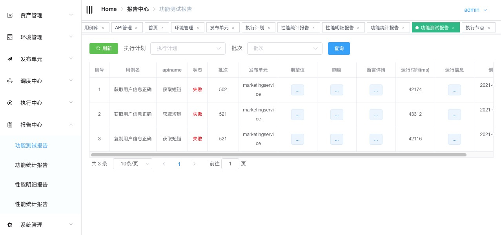

# AutoMeter

1.AutoMeter是一款针对分布式服务，微服务API做功能和性能一体的自动化测试平台,一站式提供发布单元，API，环境，用例，前置条件，场景，计划，报告等管理

项目开发，迭代交付过程中开发人员，测试人员针对系统提供的API做调试，回归测试，性能测试。自动化测试，本质上解决API测试的5大基本问题：
  
    1.由什么角色？
    2.在什么环境？
    3.针对什么目标？
    4.做什么样的测试？
    5.得到什么样的结果？

### 设计思路：
    1.对于测试整体活动围绕人员(测试人员，开发人员)，机器(服务器，移动设备)，用例(功能，性能)，可以认为这些是个人或者公司核心的测试资产
    2.有了上述的测试资产，来开展测试活动，比如说使用服务器来搭建测试环境，在测试环境上执行测试用例，获取响应的测试反馈报告
### 开展具体的测试活动，需要解决4个问题
    1.运行测试的环境如何定义？
    2.针对什么来做测试？
    3.怎么运行测试用例？
    4.获得什么样的反馈报告？

### 1.运行测试的环境如何定义？

一般个人，公司在使用分布式，微服务架构，从开发到发布上线可能会经过多套环境测试验证，比如开发环境，测试环境，准生产环境，生产环境，其中测试环境又可能分为多套功能测试环境和性能测试环境，多套环境分开管理，可以有序而不相互干扰进行测试工作
每套环境由开发的发布单元(服务，站点，应用各个公司叫法不一样)，即提供api服务能力的实体，中间件(数据库，nosql，web服务器等等)这些元素组成
对于测试来说以上的元素我们需要部署到指定的服务器或者容器中整体来作为一套环境做测试工作
### 2.针对什么来做测试？

针对具体开发的服务(发布单元，应用，站点)，既提供API的实体，这边我们命名为发布单元，可以定义访问此服务的协议，端口。
此发布单元包含了若干个API，每个API会有对应的参数需要维护，这其实也是个人或者公司提供对内对外api能力的定义
### 3.怎么运行测试用例？

从个人或者公司的角度看，用例的数量和类型来决定需要做怎么样的执行，如果用例数量庞大，并且需要快速得到结果，本质上我们需要拆分用例由多机并行执行满足需求，也就是多点执行，如果需要性能的测试，执行性能的机器我们可以是低性能的多台机器发起或者是高性能的少量机器发起，所以说怎么运行是根据需要来定制执行用例的类型和机器数量

### 4.获得什么样的反馈报告？

对于用例执行完，我们希望看到什么反馈，对于开发，测试，或者其他技术人员，我们希望看到运行的用例详细信息：结果状态，运行时间，API的具体响应，我的期望，断言的详细信息，以及用例运行时的信息，对应性能来说，我们还希望能得到统计的信息，比如整体性能的时间，tps，响应时间，99%pct等

## 架构

 [架构设计](https://www.toutiao.com/i6975322437458379271/)

## 部署
 [部署](https://www.toutiao.com/i7012047297831862816//)

## 帮助文档
[帮助文档](https://gitee.com/season-fan/autometer-api/wikis/AutoMeter%E6%96%87%E6%A1%A3/%E4%BD%BF%E7%94%A8%E6%8C%87%E5%8D%97/%E5%8F%91%E5%B8%83%E5%8D%95%E5%85%83/%E5%8F%91%E5%B8%83%E5%8D%95%E5%85%83)

[开始第一个测试用例](https://gitee.com/season-fan/autometer-api/wikis/AutoMeter%E6%96%87%E6%A1%A3/%E4%BD%BF%E7%94%A8%E6%8C%87%E5%8D%97/%E5%8F%91%E5%B8%83%E5%8D%95%E5%85%83/%E5%8F%91%E5%B8%83%E5%8D%95%E5%85%83)

  
 欢迎联系一起讨论

## License
MIT

Copyright (c) 2020-present Season
    
